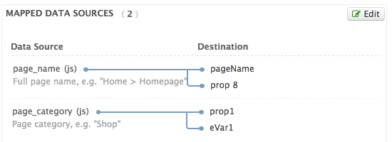

# Tealium Capture Data Layer extension

This Tealium extension captures data from existing JavaScript objects in the page.

You may find this useful if you are deploying Tealium (or other data solutions) on 
pages that already have a data object in place, particularly from existing SiteCatalyst 
implementations or from W3C data objects.

## Usage

You will need two parts: the code library, and a configuration block. 

**Step 1: Create configuration**

Create a JavaScript Code extension in your Tealium profile to hold the configuration.

The basic configuration is in the `utag_extn.capture_datalayer` namespace and looks like this:

```javascript
  utag_extn.capture_datalayer.config = {
    data_layer_name : ["s.variableName"],
    // .. more fields ..
  };
```

There is more information about the configuration required below.

**Step 2: Install code library**

Copy the source code for the extension, which is in 
[capture-datalayer-extension.js](./lib/capture-datalayer-extension.js)
and add it to your Tealium profile as JavaScript Code extension. This must go *after* the
configuration: remember you can drag-and-drop to reorder extensions.


## Capturing (legacy) SiteCatalyst data

If you want to build a UDO in Tealium from existing 's' object data in the page, you need 
to build effectively the reverse of the mapping table. For example, you might have this data 
in the page:

```html
<script type="text/javascript"><!--
  /* You may give each page an identifying name, server, and channel on
   the next lines. */
  s.pageName = "Home";
  s.prop1 = "personal";
  
  /************* DO NOT ALTER ANYTHING BELOW THIS LINE ! **************/
  var s_code = s.t();
  if (s_code)document.write(s_code);

  if (navigator.appVersion.indexOf('MSIE') >= 0) document.write(unescape('%3C') + '\!-' + '-');
//-->
</script>
```

You would need to have this in the mapping table:



Then the configuration will look like this:

```javascript
  utag_extn.capture_datalayer.config = {
    page_name : ["s.pageName"],
    page_category : ["s.prop1"]
  };
```

This will capture data into the correct UDO variables.

## Fall-back data sources

You can specify multiple sources for the data. The rule is that the data will be captured 
from the first variable in the list that is matched. For example, if the SiteCat pageName 
variable is not set on some pages, you might want to capture the document title instead. In 
this case, the configuration would look like this:

```javascript
  utag_extn.capture_datalayer.config = {
    page_name : ["s.pageName", "document.title"],
    page_category : ["s.prop1"]
  };
```

If `s.pageName` is present on the page, then it will be passed in to `utag_data.page_name`. 
If it is not present, then `utag_data.page_name` will have the value of the document title. 
If the title is not present (or it's empty) then the variable will not be set at all in the 
data layer.


## W3C data sources

The data sources are defined in the [W3 Customer Experience Digital Data Layer 1.0 spec](w3). 
You can capture these variables using the same configuration syntax as above:

 [w3]: http://www.w3.org/2013/12/ceddl-201312.pdf

The data in first example would look like this in W3C format:

```html
<script type="text/javascript">
  window.digitalData = {
    pageInstanceID: "Home-Production",
    page: {
      pageInfo: {
        pageID: "Homepage",
        destinationURL: "http://www.customer.com/home"
      },
      category: {
        primaryCategory: "personal",
        pageType: "content"
      }
    }
  };
</script>
```

And you could collect it like this:

```javascript
  utag_extn.capture_datalayer.config = {
    page_name : ["digitalData.page.pageInfo.pageID"],
    page_category : ["digitalData.page.category.primaryCategory"]
  };
```

The output mappings would be exactly same on the SiteCat tag.

## Data layer migrations: SiteCatalyst native to W3C

You can also combine multiple data sources in the list, so that you can have a phased 
roll out. For example, you may be migrating from an existing SiteCatalyst native data 
object to a W3C format data layer, This configuration captures the W3 format data if it 
is present in the page. If not, the variable will be populated from SiteCat.

```javascript
  utag_extn.capture_datalayer.config = {
    page_name : ["digitalData.page.pageInfo.pageID", "s.pageName"],
    page_category : ["digitalData.page.category.primaryCategory", "s.prop1"]
  };
```


## Data layer migrations: SiteCatalyst native to Tealium native

If you are migrating from a SiteCatalyst data object to a native Tealium UDO (data object) 
in the page, then you don't need to specify the Tealium fields in the configuration. The
code will not overwrite existing values in the UDO if they are already set.

```html
<script type="text/javascript">
  window.utag_data = {
    page_name : "Homepage",
    page_category : "personal"
  };
</script>
```

If you have this configuration to capture your SiteCatalyst data:

```javascript
  utag_extn.capture_datalayer.config = {
    page_name : ["s.pageName", "document.title"],
    page_category : ["s.prop1"]
  };
```

Then the UDO will still be populated with the values from the page, because they will take
priority over the SiteCatalyst data.


## Running the tests

If you want to run the tests or contribute to the extension code, there is a simple web server
in Node.js:

```
  npm install
  npm start
```
